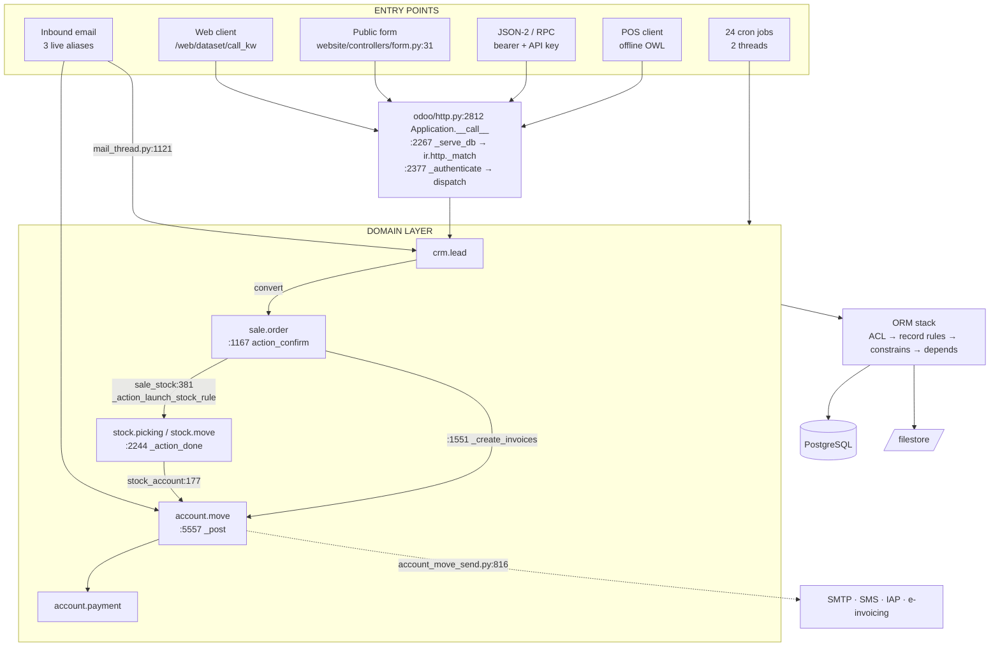
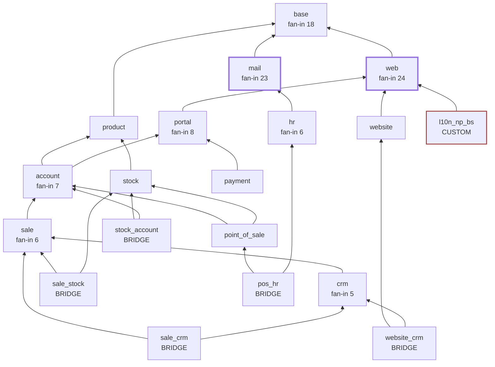

# Module analysis

**Read-only.** No code was modified.

---

## Scope, and why it is scoped

The tree holds **686 modules**. Analysing all of them across 18 dimensions would produce
something nobody can act on — and **590 are not installed**, so they are inert code with no
runtime behaviour to analyse.

Scope actually delivered:

| Tier | Modules | Depth |
|---|---:|---|
| **1 — Exhaustive** | `l10n_np_bs` | All 18 dimensions, complete |
| **2 — Deep** | 15 core installed modules | All 18 dimensions, condensed |
| **3 — Catalogued** | remaining ~79 installed | Purpose, role, dependency position |
| **4 — Inventory only** | 590 uninstalled | Out of scope; listed as latent capability |

Tags: ✅ **Confirmed** (read from code/DB) · 🔶 **Inferred** · ❓ **Unknown**

---

# TIER 1 — `l10n_np_bs` (exhaustive)

✅ The only module this project authored. 1,471 lines across 18 files.

## 1. Purpose

Renders and accepts dates in **Bikram Sambat** (the Nepali calendar) while PostgreSQL keeps
storing Gregorian dates. Two deliverables: a field widget, and a browsable calendar app.

Storage is deliberately untouched — every ORM domain, `group by`, and report keeps working
because BS exists only in the presentation layer.

## 2. Public interfaces

| Interface | Contract | Consumer |
|---|---|---|
| `widget="bs_date"` | Field widget on any `date`/`datetime` field | View XML authors |
| Widget options | `{'month_name': bool, 'np_digits': bool}` | View XML authors |
| Client action tag `l10n_np_bs.calendar` | Browsable BS month grid | Menu / action records |
| `tools.bs.ad_to_bs(date)` → `(y,m,d)` | Python conversion | Server-side code, reports |
| `tools.bs.bs_to_ad(y,m,d)` → `date` | Python conversion | Server-side code |
| `tools.bs.format_bs(value, fmt, np_digits, month_names)` | Formatting | QWeb reports |
| `tools.bs.parse_bs(text)` → `date` | Parsing (ASCII or Devanagari digits) | Import routines |
| JS `adToBs / bsToAd / formatBs / parseBs` | Browser conversion | Other OWL components |

## 3. Entry points

| Entry point | Trigger | File |
|---|---|---|
| Field widget registration | Asset bundle load | `bs_date_field.js` → `registry.category("fields").add("bs_date", …)` |
| Client action registration | Asset bundle load | `bs_calendar_action.js` → `registry.category("actions").add("l10n_np_bs.calendar", …)` |
| Menu item | User clicks *Nepali Calendar* | `views/bs_calendar_menus.xml` → `ir.actions.client` |
| Table generator (CLI) | Developer runs it | `tools/gen_js_data.py` |
| Self-test (CLI) | Developer runs it | `tools/selftest.py` |

## 4. Main classes / functions

| Symbol | File | Role |
|---|---|---|
| `BSDateField` | `bs_date_field.js` | OWL component: display, text input, month-grid picker |
| `bsDateField` | `bs_date_field.js` | Field registry descriptor (`supportedTypes`, `extractProps`) |
| `BSCalendar` | `bs_calendar_action.js` | Client action; `Layout`-wrapped month grid |
| `adToBs` / `bsToAd` | `bs_convert.js` | Browser conversion, UTC-based day arithmetic |
| `bsMonthLength` | `bs_convert.js` | Table lookup; raises `BSRangeError` out of range |
| `ad_to_bs` / `bs_to_ad` | `tools/bs.py` | Python conversion, wraps `nepali_datetime` |
| `format_bs` / `parse_bs` | `tools/bs.py` | Devanagari-aware formatting/parsing |
| `main()` | `tools/gen_js_data.py` | Emits `bs_calendar_data.js` from the vendored CSV |

## 5. Internal dependencies

✅ Manifest declares `depends: ['web']` **only** — deliberately minimal.

```
bs_calendar_action.js ─┐
bs_date_field.js      ─┼─► bs_convert.js ──► bs_calendar_data.js  (generated)
                       │
                       └─► @web/search/layout, @web/core/registry,
                           @web/views/fields/standard_field_props,
                           @web/webclient/actions/action_service, @odoo/owl
tools/bs.py ──► odoo.exceptions.UserError, odoo.tools.translate
```

## 6. External dependencies

| Dependency | Where | Status |
|---|---|---|
| **`nepali-datetime` 1.0.8.5** | `tools/bs.py`, `tools/gen_js_data.py`, `tools/selftest.py` | ⚠️ Declared in `__manifest__.py` `external_dependencies` — **which pip never reads.** Absent from `requirements.txt` |
| `polib` | not used here | — |
| `lxml` | `tests/test_calendar_ui.py` (XML validity test) | Already an Odoo core dep |

## 7. Database tables / entities

✅ **The module defines no models and creates no tables.** It writes nothing.

| Entity | Interaction |
|---|---|
| `ir.actions.client` | 1 record created (module data) |
| `ir.ui.menu` | 1 record created (module data) |
| any `date`/`datetime` column | Read and written **through the host model's ORM** — never directly |

🔶 The `models/` directory exists and is **empty** — dead scaffolding.

## 8. Configuration used

| Setting | Effect |
|---|---|
| `addons_path` must include `custom_addons` | Module discovery |
| Nothing else | No `ir.config_parameter`, no res.config.settings entries |

Two literal constants are hardcoded in the widget rather than configured: the supported
range (`BS_MIN_YEAR 1975` / `BS_MAX_YEAR 2100`) and the default `np_digits = true`.

## 9. Authentication / authorization

⚠️ ✅ **The module has no `security/` directory — no `ir.model.access.csv`, no groups.**

This is *acceptable only because it owns no models*. Consequences:

- The client action and menu are visible to **every internal user**; there is no way to
  restrict the Nepali Calendar to a subset
- The widget inherits the host field's access control entirely — correct behaviour
- ❓ **Unknown** whether the calendar should be role-restricted

## 10. Error handling

| Layer | Mechanism |
|---|---|
| Python | Raises `odoo.exceptions.UserError` with a translated message for out-of-range and unparseable dates (`bs.py` `ad_to_bs`, `bs_to_ad`, `parse_bs`) |
| Python | `_require_lib()` raises `UserError` with install instructions if `nepali_datetime` is missing |
| JS | Custom `BSRangeError` for out-of-range; caught in `bsValue` getter and degraded to the literal string `"out of BS range"` |
| JS | `onInputChange` shows a `notification` service warning rather than throwing |
| Generator | `gen_js_data.py` **refuses to emit** if its table replay disagrees with the library (`sys.exit`) |

🔶 Reasonable. One gap: the JS `bsValue` getter swallows *all* exceptions with a bare
`catch {}`, so a genuine bug would present as "out of BS range" rather than surfacing.

## 11. Logging

⚠️ ✅ **The module emits no logs at all.** No `_logger` anywhere. Conversion failures reach
the user as notifications but leave no server-side trace.

## 12. Tests

✅ `tests/test_calendar_ui.py`, 133 lines, three classes, layered cheapest-first:

| Class | Type | Covers |
|---|---|---|
| `TestBSAssets` | Pure Python | **Every XML file parses**; every manifest-declared asset exists on disk |
| `TestBSConversion` | Pure Python | Known dates, 80-year round-trip sweep, Devanagari formatting, out-of-range raises |
| `TestBSCalendarUI` | Headless Chrome | Calendar renders with >20 day cells |

Plus `tools/selftest.py` — an out-of-band exhaustive check comparing the generated JS table
against `nepali-datetime` for **all 46,022 days** in range.

Prerequisites recorded in the docstring: `websocket-client`, pre-built assets, tours disabled.

## 13. Important algorithms

**BS↔AD conversion is table-driven, not formulaic** — this is the module's central technical
fact. Bikram Sambat months run **29–32 days and vary year to year** from published
astronomical tables; there is no closed form.

```
adToBs(y, m, d):
    remaining = daysBetweenUTC(EPOCH_AD, (y,m,d))      # EPOCH = BS 1975-01-01 = AD 1918-04-13
    year = BS_MIN_YEAR
    while remaining >= sum(MONTH_DAYS[year]):          # consume whole years
        remaining -= sum(MONTH_DAYS[year]); year += 1
    month = 1
    while remaining >= MONTH_DAYS[year][month-1]:      # consume whole months
        remaining -= MONTH_DAYS[year][month-1]; month += 1
    return (year, month, remaining + 1)
```

Two deliberate correctness measures:
1. **Single source of truth** — the JS table is *generated* from the same CSV the Python side
   uses, so the two cannot drift
2. **UTC-only arithmetic** — all day maths uses `Date.UTC`, because a local-midnight `Date`
   can fall on the previous day in UTC and shift the BS date by one

## 14. Known assumptions

1. Supported range is **BS 1975–2100 / AD 1918-04-13 – 2044-04-12**; outside it, raise
2. Bikram Sambat weeks start **Sunday**; Saturday is the weekly holiday (red in the calendar)
3. Devanagari digits are the sensible default for display
4. `nepali-datetime`'s table is authoritative
5. Storage stays Gregorian — BS never persists
6. Only *one* calendar system per field; no per-user preference

## 15. Technical debt

| Item | Evidence | Severity |
|---|---|---|
| **`nepali-datetime` in no pip-readable file** | `__manifest__.py` only | **High** — clean install breaks |
| **Empty `models/` directory** | 0 entries | Low — dead scaffolding |
| **Range hardcoded in two places** | `bs_convert.js`, `bs.py` (via library) | Medium |
| **No logging** | no `_logger` | Medium |
| **Bare `catch {}`** in `bsValue` | `bs_date_field.js` | Medium — masks real bugs |
| **Generated file is committed** | `bs_calendar_data.js` | Low — intentional, but needs regeneration discipline |
| **No `security/`** | absent | Low today; blocks role restriction later |

## 16. Security concerns

🔶 **Low attack surface** — no models, no controllers, no routes, no SQL, no network I/O,
no user input reaching the server except through the host field's normal ORM path.

| Consideration | Assessment |
|---|---|
| Input validation | `parseBs`/`parse_bs` validate before conversion; invalid input rejected |
| Injection | None — no SQL, no `eval`, no template interpolation of user data |
| XSS | Templates use `t-esc` (escaping), never `t-raw` |
| Access control | Deferred to the host field — correct |
| Supply chain | ⚠️ Depends on `nepali-datetime`, a small third-party package; **the whole calendar's correctness rests on its data table** |

## 17. Scalability concerns

🔶 **Negligible.** Conversion is O(years + months) ≈ 130 iterations worst case, pure
arithmetic, no I/O. The 126-year table is ~160 lines of JS in the bundle.

One note: the calendar action recomputes `cells` on every render rather than memoising —
irrelevant at 32 cells.

## 18. Maintainability concerns

| Concern | Detail |
|---|---|
| **Table regeneration discipline** | If `nepali-datetime` updates its CSV, `gen_js_data.py` must be re-run or Python and JS silently diverge. Nothing enforces this |
| **OWL idiom traps** | This module already shipped two: `not` is invalid in OWL expressions (use `!`), and `--` is illegal inside XML comments — the latter blanked the entire backend |
| **`Layout` requirement** | Client actions must wrap in `<Layout>` or render blank with no error |
| **Bus factor** | Requires Nepali domain knowledge *and* OWL internals |
| **Translation coupling** | Ships no `.po`; UI strings are hardcoded Nepali/English mixes |

---

# TIER 2 — Core installed modules (deep)

✅ Metrics measured from the tree; models counted from `ir_model_data`.

| Module | py-LOC | js-LOC | models | test files | controllers | Fan-in |
|---|---:|---:|---:|---:|---:|---:|
| `base` | 30,436 | 42 | 124 | 86 | 0 | 18 |
| `account` | 42,037 | 9,072 | 84 | 72 | 6 | 7 |
| `mail` | 28,397 | 23,985 | 78 | 28 | 13 | **23** |
| `stock` | 17,903 | 4,034 | 63 | 29 | 2 | 3 |
| `website` | 12,151 | 23,152 | 55 | 44 | 7 | 4 |
| `point_of_sale` | 10,184 | **44,932** | 70 | 31 | 3 | 3 |
| `sale` | 8,094 | 4,300 | 28 | 33 | 4 | 6 |
| `web` | 7,147 | 4,005 | — | 30 | 20 | **24** |
| `product` | 6,281 | 1,257 | 33 | 15 | 4 | 4 |
| `crm` | 5,018 | 2,671 | 22 | 19 | 2 | 5 |
| `payment` | 4,944 | 1,003 | 9 | 11 | 3 | 4 |
| `hr` | 4,803 | 2,665 | 31 | 20 | 0 | 6 |
| `stock_account` | 3,359 | 485 | 24 | 8 | 0 | 2 |
| `portal` | 2,466 | 1,528 | 10 | 8 | 7 | 8 |
| `sale_stock` | 1,789 | 248 | 21 | 15 | 2 | 1 |

### Per-module summary

**`base`** — ✅ The framework's own data model expressed as models: `ir.model`, `ir.ui.view`,
`ir.rule`, `ir.cron`, `ir.attachment`, `res.users`, `res.company`, `res.partner`. *Purpose:*
make the framework runtime-customisable. *Auth:* owns the entire ACL/record-rule machinery.
*Debt:* 124 models in one module; the boundary between "framework" and "addon" is blurred.

**`web`** — ✅ Highest fan-in (24). The OWL client, view renderers, asset bundling.
*Entry points:* 20 controllers. *Scalability:* SCSS/JS compiled **in the request path**.
*Debt:* asset-bundle staleness is a recurring operational failure (observed in this session).

**`mail`** — ✅ Fan-in 23. `mail.thread` and `mail.activity.mixin` are inherited by nearly
every business model. *Entry points:* inbound gateway (`message_route:1121` →
`message_process:1437` → `message_new:1514`) with **3 live aliases**; outbound queue drained
hourly. *Security:* ⚠️ aliases accept mail from `everyone`. *Logging:* 24 files with loggers —
the best-instrumented module.

**`account`** — ✅ Largest business module. *Algorithms:* double-entry invariant enforced as a
**context manager** (`_check_balanced`) not a constraint, because derived lines are
regenerated mid-transaction; the tax engine is **mirrored in Python and JavaScript**
(`account_tax.py:727–4952` ↔ `static/src/helpers/account_tax.js`) with a shared conformance
harness; gapless numbering via `sequence.mixin`; optional hash-chaining for inalterability.
*Debt:* `account_move.py` is 7,456 lines. *Assumption:* one table serves 7 document types.

**`stock` + `stock_account`** — ✅ Moves, pickings, quants, procurement rules. `stock_account`
is the bridge that turns a completed move into a valuation journal entry
(`stock_account/models/stock_move.py:177` extending `_action_done`). *Scalability:* the
procurement scheduler is a single daily cron over all rules.

**`sale` + `sale_stock`** — ✅ Quotation → order → invoice. `sale_stock` is a pure bridge
(1,789 LOC) launching procurement on confirm. *Logging:* ⚠️ **`sale` has zero module
loggers** — the revenue path is silent.

**`point_of_sale`** — ✅ **44,932 js-LOC vs 10,184 py-LOC** — overwhelmingly a front-end
application with an offline local store and a sync protocol. *Auth:* cashiers identify as
`hr.employee` (via `pos_hr`), not Odoo users. *Scalability:* session close creates one
summarised journal entry, so DB load is per-session not per-order.

**`website`** — ✅ Public site + page builder. *Entry points:* `website/controllers/form.py:31`
accepts anonymous POSTs (`csrf=False`, captcha-gated). *Security:* ⚠️ the model whitelist
(`ir.model.website_form_access`) is the only thing standing between the public and record
creation.

**`crm`**, **`hr`**, **`product`**, **`portal`**, **`payment`** — conventional business
modules. `payment` is notable for being fully wired but having **all 24 providers disabled**.

---

# TIER 3 — Remaining installed modules (catalogued)

✅ Grouped by role. All installed; none analysed in depth.

| Group | Modules | Role |
|---|---|---|
| **Framework/technical** | `bus`, `http_routing`, `web_tour`, `web_hierarchy`, `base_import`, `base_import_module`, `base_install_request`, `base_setup`, `onboarding`, `rpc`, `api_doc`, `uom`, `resource`, `analytic`, `digest`, `utm`, `barcodes`, `barcodes_gs1_nomenclature`, `iot_base`, `privacy_lookup`, `spreadsheet` | Plumbing; no business semantics |
| **Auth** | `auth_signup`, `auth_totp`(+`_mail`,`_portal`), `auth_passkey`(+`_portal`) | Identity |
| **Editor/CMS** | `html_editor`, `html_builder`, `web_unsplash`, `social_media` | Content authoring |
| **Messaging** | `mail_bot`, `mail_bot_hr`, `sms`, `snailmail`, `snailmail_account`, `phone_validation` | Channels |
| **IAP (paid SaaS)** | `iap`, `iap_crm`, `iap_mail`, `crm_iap_enrich`, `crm_iap_mine`, `partner_autocomplete` | ⚠️ Outbound to Odoo SA |
| **Google/Microsoft** | `google_gmail`, `google_recaptcha`, `google_address_autocomplete`, `microsoft_outlook` | OAuth integrations |
| **Sales bridges** | `sale_crm`, `sale_sms`, `sale_edi_ubl`, `sales_team`, `crm_sms` | Cross-app glue |
| **Accounting adj.** | `account_payment`, `account_edi_ubl_cii`, `account_add_gln` | E-invoicing, payment link |
| **Stock bridges** | `stock_sms` | Notifications |
| **POS** | `pos_hr`, `pos_online_payment` | Till identity + payment |
| **Website bridges** | `website_crm`, `website_crm_sms`, `website_mail`, `website_payment`, `website_sms` | Public-site glue |
| **HR** | `hr_org_chart`, `hr_skills`, `hr_calendar`, `hr_homeworking`(+`_calendar`) | Employee features |
| **Dashboards** | `spreadsheet_account`, `spreadsheet_dashboard`(+`_account`,`_sale`,`_pos_hr`,`_stock_account`) | Reporting |
| **Custom** | `l10n_np_bs` | See Tier 1 |

---

# TIER 4 — Uninstalled (inventory only)

✅ **590 modules** present on disk, not installed, **not analysed**. They contribute zero
runtime behaviour but do contribute: repository size, upgrade surface, and 21 Enterprise
placeholder records in `ir_module_module`.

Largest latent families: `l10n_*` (224), `website_*` (54), `*_sale*` (51), `*_edi*` (43),
`test_*` (41), `payment_*` (23).

---

# Call-flow diagram



# Dependency diagram

✅ 212 dependency edges among the 94 installed modules. Fan-in measured from
`ir_module_module_dependency`.



**The pattern that matters:** `sale`, `stock` and `account` never import each other.
Bridge modules (`sale_stock`, `stock_account`) depend on both sides and extend the same
method names from outside. This is why a workflow crosses four modules with no circular
dependency — and why removing a bridge cleanly severs a business flow.

# Important file map

| Concern | File | Why it matters |
|---|---|---|
| Process entry | `odoo/__main__.py`, `odoo/cli/command.py:109` | The only entry point |
| Server selection | `odoo/service/server.py:1616`, `:451` | ThreadedServer active here |
| HTTP dispatch | `odoo/http.py:2812`, `:2267`, `:2377` | Every request |
| Auth per route | `addons/base/models/ir_http.py:212,271,298` | Bearer/user/public |
| ORM core | `odoo/orm/registry.py`, `models.py` | Class merging, cache signalling |
| Cron | `addons/base/models/ir_cron.py:187,308,399` | Row-locked job acquisition |
| Inbound mail | `addons/mail/models/mail_thread.py:1121,1437,1514` | 3 live aliases |
| Public form | `addons/website/controllers/form.py:31` | Anonymous POST, `csrf=False` |
| Order → stock | `addons/sale_stock/models/sale_order_line.py:381` | Procurement launch |
| Stock → GL | `addons/stock_account/models/stock_move.py:177` | Valuation entry |
| Invoice post | `addons/account/models/account_move.py:5557` | Numbering, balance, hash |
| Balance invariant | `addons/account/models/account_move.py:2767` | Context manager, not constraint |
| Tax engine (py) | `addons/account/models/account_tax.py:727-4952` | Mirrored in JS |
| Tax engine (js) | `addons/account/static/src/helpers/account_tax.js` | Must match Python |
| POS close → GL | `addons/point_of_sale/models/pos_session.py:868` | One entry per session |
| Custom conversion | `custom_addons/l10n_np_bs/tools/bs.py` | AD↔BS |
| Custom table (gen) | `custom_addons/l10n_np_bs/static/src/bs_calendar_data.js` | **Generated — do not hand-edit** |

---

# Questions requiring SME confirmation

**Business**
1. Is the target market Nepal? The BS calendar and 87 Nepali translation files say yes; the company is configured **US / USD / generic chart of accounts**. Which is authoritative?
2. `purchases@` routes inbound mail to `account.move`, but `purchase` is not installed. Is email the intended vendor-bill intake, or is this leftover?
3. Is the absence of `website_sale` deliberate — i.e. the website markets but never sells?
4. Are the 34 employee and 40 contact records real people? This determines privacy obligations.

**Technical**
5. Should the Nepali Calendar app be restricted by role? It currently has no ACLs and is visible to every internal user.
6. Who owns regenerating `bs_calendar_data.js` when `nepali-datetime` updates? Nothing enforces it.
7. Is `l10n_ne/` writing into `odoo/addons/*/i18n_extra/` an accepted risk? It is erased by any Odoo upgrade.
8. Should `nepali-datetime` and `websocket-client` be added to a pip-readable manifest? Clean installs currently break.

**Operational**
9. Is a `fetchmail.server` configured? Without one the three mail aliases never fire.
10. Will `payment` providers be enabled? All 24 are disabled, so online collection is impossible.
11. Is `max_cron_threads = 2` adequate for 24 jobs, given the procurement scheduler and invoice sender both run daily?
12. Is this instance ever intended to face the internet? If so, `list_db = True`, the default `admin_passwd`, and the absent password-policy/session-timeout modules are blockers.

---

*Analysed read-only from module manifests, source files, `ir_module_module`,
`ir_module_module_dependency` and `ir_model_data`. Tier 4 (590 uninstalled modules) was
inventoried, not analysed. No files were modified.*
