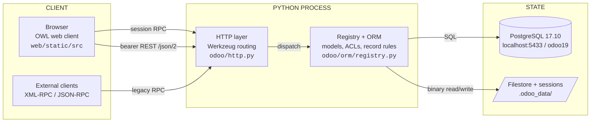
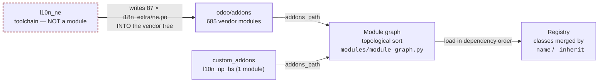

# Odoo 19.0 — Repository Reconnaissance Dossier

**Subject:** `odoo-19.0` source distribution + local additions
**Version:** `19.0-20260807` · **License:** LGPL-3
**Method:** static file inspection + live database introspection
**Mutations:** none — read-only survey

---

## Executive summary

Roughly 99% of this tree is unmodified upstream Odoo. Three components are genuinely
*yours* to own:

| Component | What it is | Risk |
|---|---|---|
| `custom_addons/l10n_np_bs/` | A proper Odoo module (Bikram Sambat calendar) | Normal |
| `l10n_ne/` | A translation **toolchain** — not a module | Confusing placement |
| 87 × `odoo/addons/*/i18n_extra/ne.po` | Translation files **written into the vendor tree** | **Destroyed by any upgrade** |

**Headline numbers**

| Metric | Value |
|---:|---|
| Module directories | 686 (685 vendor + 1 local) |
| Installed modules | 94 |
| Python files | 8,732 |
| JavaScript files | 5,887 |
| XML files | 6,727 |
| Translation files (`.po`) | 21,932 |
| CI pipelines | **0** |
| Container definitions | **0** |

**Three findings that should drive the first sprint:** the vendor tree has been modified
in 87 places; secrets sit in plaintext with the database manager exposed; and nothing
verifies a change before it reaches a running system.

---

## 1. Repository structure

This is a Python **source distribution (sdist)**, not a git checkout of upstream. The
distinction matters — packaging metadata and entry points differ from what Odoo's own
documentation assumes.

| Claim | Evidence |
|---|---|
| Top level is thin: packaging metadata, the `odoo/` package, a `setup/` helper dir; everything else at root is local | `ls -a` → `LICENSE`, `MANIFEST.in`, `PKG-INFO`, `README.md`, `requirements.txt`, `setup.py`, `setup.cfg`, `odoo/`, `setup/`, `doc/` |
| It is an sdist, not a checkout | `PKG-INFO` present at root; `odoo.egg-info/` present |
| No upstream `odoo-bin`; the console entry point is declared instead | `setup.py:23` → `scripts=['setup/odoo']`; `setup/odoo` → `odoo.cli.main()` |
| Three local additions plus a runtime data dir and a PowerShell wrapper | `custom_addons/`, `l10n_ne/`, `run-odoo.ps1`, `odoo.conf`, `odoo.conf.example`, `.odoo_data/`, `.gitignore` |
| No architecture or ops documentation ships with the tree | `doc/` contains 1 entry: `cla` (contributor licence agreements) |

```
odoo-19.0/
├── odoo/                    ← framework + 685 vendor modules
│   ├── orm/ http.py service/ modules/ cli/ tools/ tests/ _monkeypatches/
│   └── addons/              ← the business modules
├── custom_addons/           ← LOCAL: l10n_np_bs
├── l10n_ne/                 ← LOCAL: translation toolchain (not a module)
├── setup/                   ← packaging helpers (partly broken, see §5)
├── doc/cla/                 ← CLAs only
├── odoo.conf                ← LOCAL, gitignored (holds secrets)
├── odoo.conf.example        ← tracked template
├── run-odoo.ps1             ← LOCAL dev wrapper
└── .odoo_data/              ← LOCAL runtime state (filestore, sessions, logs)
```

---

## 2. Major applications / modules / packages

Two distinct package systems coexist and are frequently confused: the **Python package**
`odoo` (the framework) and **Odoo's own module system** (the business applications). They
have different dependency rules.

### Framework packages

| Package | Responsibility | Evidence |
|---|---|---|
| `odoo/orm/` | Registry, models, fields, domains, environments | `registry.py`, `models.py`, `fields_*.py`, `domains.py` |
| `odoo/http.py` | Routing, request/response, sessions, dispatch | 2,901 lines |
| `odoo/service/` | Server loop, RPC dispatch, DB lifecycle | `server.py`, `model.py`, `db.py`, `security.py` |
| `odoo/modules/` | Module discovery, dependency graph, loading, migration | `module_graph.py`, `loading.py`, `migration.py` |
| `odoo/cli/` | Subcommands | `server`, `shell`, `scaffold`, `db`, `deploy`, `populate`, `cloc`, `neutralize`, `upgrade_code` |
| `odoo/tools/` | Utility layer incl. asset pipeline, safe_eval, profiler | `safe_eval.py`, `convert.py`, `js_transpiler.py`, `profiler.py` |
| `odoo/_monkeypatches/` | Import-time patches to 22 third-party libraries | `werkzeug.py`, `lxml.py`, `requests.py`, `pytz.py`, … |

**`odoo/fields`, `odoo/api`, `odoo/models` are re-export shims only** — the implementation
moved into `odoo/orm/`. The reason is stated in the file itself:

> `odoo/fields/__init__.py` — *"Exports features of the ORM to developers. This is a
> `__init__.py` file to avoid merge conflicts on `odoo/fields.py`"*

### Business modules

| Claim | Evidence |
|---|---|
| 685 vendor modules + 1 local = 686 module directories | `find odoo/addons -maxdepth 2 -name __manifest__.py` → 685 |
| Database holds 707 module records; 21 are Enterprise placeholders with no code here | `ir_module_module` → installed 94, uninstalled 590, uninstallable 23 |

Naming encodes dependency direction — bridge modules (`sale_stock`) depend on two apps so
neither app depends on the other:

`l10n_*` 224 · `website_*` 54 · `*_sale*` 51 · `*_edi*` 43 · `test_*` 41 · `hr_*` 27 · `payment_*` 23

**Derivation:** `ls -d <pattern> | wc -l` inside `odoo/addons/`.

---

## 3. Programming languages

**Derivation** — file counts below come from enumerating the working tree, excluding the
virtualenv, git internals and runtime data:

```
find . -name "*.<ext>" -not -path "./venv/*" -not -path "./.git/*" -not -path "./.odoo_data/*" | wc -l
```

| Language / format | Files | Role |
|---|---:|---|
| Gettext `.po` | 21,932 | Translations — largest artefact class by count |
| Python | 8,732 | Framework + all server-side business logic |
| XML | 6,727 | Views, data, QWeb + OWL templates |
| JavaScript | 5,887 | OWL web client, widgets, tours |
| SCSS | 1,273 | Styling, compiled server-side |
| CSV | 910 | Access-control rows and seed data |
| Gettext `.pot` | 607 | Translation templates |
| SQL | 78 | Migration / utility scripts |
| PowerShell | 1 | `run-odoo.ps1` — local, not upstream |

**No TypeScript build.** JS is authored as native ES modules and rewritten at serve time by
`odoo/tools/js_transpiler.py`. Type declarations under `web/static/src/@types/` exist for
editor support only.

---

## 4. Frameworks and libraries

The defining characteristic: **Odoo is its own framework.** No Django, no Flask, no
SQLAlchemy, no React. Substitutes are in-house and deeply coupled.

| Layer | What it uses | Evidence |
|---|---|---|
| HTTP / WSGI | Werkzeug 3.0.1 | `requirements.txt`; `odoo/http.py` |
| ORM | In-house, over psycopg2 2.9.9 | `odoo/orm/*`; `odoo/sql_db.py` |
| Front end | OWL (Odoo's own reactive framework) | `web/static/src/**`; `@odoo/owl` imports |
| Templating | QWeb (server) + OWL templates (client) | `base/models/ir_qweb.py` |
| Async workers | gevent + greenlet — **excluded on Windows** | `requirements.txt` `sys_platform != 'win32'` |
| Documents | reportlab, PyPDF2, openpyxl, xlsxwriter, xlrd, xlwt | `requirements.txt` |
| Security | cryptography 42.0.8, pyopenssl, passlib, asn1crypto, cbor2 | `requirements.txt` |
| SOAP / geo / calendar | zeep, geoip2, vobject | `requirements.txt` |

**SCSS compilation and JS minification run inside the Python process at request time** —
there is no front-end build step. Evidence: `libsass 0.22.0` and `rjsmin 1.2.0` in
`requirements.txt`; `base/models/assetsbundle.py`.

---

## 5. Build tools

| Claim | Evidence |
|---|---|
| Classic setuptools; no `pyproject.toml`, no PEP 517 backend | `setup.py` (`find_namespace_packages`), `setup.cfg`, `MANIFEST.in` |
| The asset pipeline *is* the build system — bundles compiled on demand, cached as `ir.attachment` keyed by version hash | `base/models/assetsbundle.py`; `ir_attachment` → `/web/assets/<hash>/web.assets_web.min.js` |
| Version-migration codemods ship in-tree and are CLI-runnable | `odoo/upgrade_code/` (`17.5-01-tree-to-list.py`, `18.1-02-route-jsonrpc.py`, …); `odoo/cli/upgrade_code.py` |

### ⚠ `setup/package.py` is dead code in this distribution

The deb/rpm/docker build driver references four Dockerfiles, an RPM spec and a `debian/`
directory — **none of which ship in this sdist**. It cannot run as-is.

| Referenced at | Path referenced | Present? |
|---|---|---|
| `setup/package.py:198` | `setup/package.dfsrc` | **missing** |
| `setup/package.py:199` | `setup/package.dfdebian` | **missing** |
| `setup/package.py:200` | `setup/package.dffedora` | **missing** |
| `setup/package.py:201` | `setup/package.dfwine` | **missing** |
| `setup/package.py:352` | `setup/rpm/odoo.spec` | **missing** |
| `setup/package.py:317` | `debian/changelog` | **missing** |

---

## 6. Package managers

| Claim | Evidence |
|---|---|
| **pip only** — no `package.json`, no lockfile of any kind, anywhere | `requirements.txt` (108 lines); no `package.json` / `yarn.lock` / `poetry.lock` / `Pipfile` found |
| Pins are conditional on interpreter version and platform, targeting distro packages | `requirements.txt:1-2` — *"officially supported versions … are their `python3-*` equivalent distributed in Ubuntu 24.04 and Debian 12"* |

### ⚠ Dependency drift

Two packages are installed in the venv but **not declared anywhere pip reads**:

| Package | Needed by | Declared in |
|---|---|---|
| `nepali-datetime` | `custom_addons/l10n_np_bs` (Python conversion + JS table generation) | `__manifest__.py` `external_dependencies` only — pip never reads this |
| `websocket-client` | `odoo/tests/common.py` `ChromeBrowser` (browser tests) | **nowhere** — absence causes `unittest.SkipTest` |

---

## 7. Configuration files

| File | Purpose | Tracked? |
|---|---|---|
| `odoo.conf` | Live runtime config — DB credentials, ports, `addons_path` | No — gitignored ✅ |
| `odoo.conf.example` | Template with placeholders | Yes |
| `requirements.txt` | Python dependency pins | Yes (vendor) |
| `setup.cfg` | flake8 + `egg_info` config only | Yes (vendor) |
| `.gitignore` | Excludes `venv/`, `.odoo_data/`, `odoo.conf`, caches | Yes |
| `__manifest__.py` ×686 | Per-module metadata, deps, data files, assets | Yes |
| `.claude/settings.local.json` | Local tool permissions | **Yes — should not be** |

---

## 8. Environment and configuration strategy

Configuration resolves through a documented precedence chain in `odoo/tools/config.py`.
Environment variables are supported, but only for options that declare an `env_name`.

**Precedence:** command line → environment variable → config file → built-in default.

| Claim | Evidence |
|---|---|
| The config file path itself is env-resolvable | `odoo/tools/config.py:223` → `env_name='ODOO_RC'` |
| Fallback chain for the config file | `:519-526` → `./odoo.conf`, then `~/.odoorc`, then `~/.openerp_serverrc` |
| Environment is consulted during parse | `:619` → `environ = os.environ` |

### Current effective configuration

```ini
admin_passwd = admin          ; ⚠ default master password
db_host = localhost
db_port = 5433
db_user = odoo
db_password = odoo            ; ⚠ plaintext secret
db_name = odoo19
db_maxconn = 64
addons_path = …\odoo\addons,…\custom_addons
data_dir = …\.odoo_data
http_interface = 127.0.0.1
http_port = 8069
gevent_port = 8072
workers = 0                   ; forced — no gevent on Windows
max_cron_threads = 2
log_level = info
log_handler = :INFO
list_db = True                ; ⚠ database manager exposed
```

**Risks:**

- **Secrets in plaintext** — `db_password` and `admin_passwd` live in `odoo.conf`.
- **Database manager exposed** — `list_db = True` allows create/drop/backup, gated only by
  `admin_passwd`, which is `admin`.
- **No environment separation** — one config file, one database, no dev/stage/prod split,
  no secret store.
- **Windows forces single-process** — `requirements.txt` excludes gevent/greenlet on
  `sys_platform == 'win32'`, so `workers = 0` is a platform constraint, not a tuning choice.

---

## 9. Databases and data stores

Three distinct persistence layers, only one of which is the database. **Any backup plan
covering only PostgreSQL is incomplete.**

| Store | Location | Holds |
|---|---|---|
| PostgreSQL 17.10 | `localhost:5433` / `odoo19` | All relational data; JSONB columns for translations |
| Filestore | `.odoo_data/filestore/odoo19` | Attachments, images — content-addressed on disk |
| Sessions | `.odoo_data/sessions` | Server-side session files |
| Asset cache | `ir_attachment` + filestore | Compiled JS/CSS bundles |

| Claim | Evidence |
|---|---|
| PostgreSQL is mandatory, not swappable | `odoo/sql_db.py` → `ConnectionPool` (:610), `Cursor` (:281); psycopg2 throughout |
| Sessions are filesystem-backed — pins the server to one node unless shared | `odoo/http.py:995` `class FilesystemSessionStore`; `:2772` `config.session_dir` |
| The PG instance hosts a second, unrelated database | `pg_database` → 3 non-template DBs: `odoo19`, `ist_datahub`, `postgres` |
| Two roles; Odoo refuses to run as superuser by design | `pg_roles` → `postgres` (super), `odoo` (no super, createdb); `odoo/cli/server.py:37-44` `check_postgres_user()` → `sys.exit(1)` |

---

## 10. External integrations

Integration capability is broad but almost entirely **latent** — the modules exist on disk
and only a subset is installed.

> **Needs Verification** — whether any installed integration holds live credentials. I did
> not read `ir_config_parameter`, so I make no claim either way. An earlier draft of this
> document asserted "none is configured with live credentials"; that was unverified and has
> been withdrawn.

**Derivation:** `ls -d <pattern>* | wc -l` inside `odoo/addons/`. Counts are modules
*present on disk*, not modules installed — see §2 for the installed subset.

| Family | Modules | Nature |
|---|---:|---|
| `payment_*` | 23 | Payment provider gateways |
| `google_*` | 5 | Calendar, Gmail, address autocomplete, reCAPTCHA |
| `microsoft_*` | 3 | Outlook / M365 calendar and mail |
| `iap*` | 3 | Odoo In-App Purchase — metered calls to Odoo SA |
| `sms*`, `snailmail*` | 4 | SMS and physical mail, via IAP |
| `*_edi*` | 43 | Electronic invoicing / national mandates |

| Claim | Evidence |
|---|---|
| Outbound HTTP, SOAP and GeoIP capability present | `requirements.txt` → requests 2.31.0, zeep 4.2.1 (SOAP), geoip2 2.9.0, urllib3 2.0.7 |
| Mail is bidirectional — outbound SMTP plus an inbound gateway routing messages into records | `base/models/ir_mail_server.py`; `mail/` module (41,834 py-LOC) |

> **Needs Verification** — whether any integration holds live credentials, and whether this
> host has outbound internet access. IAP, Unsplash and partner-autocomplete all phone home
> when used.

---

## 11. API technologies

**Four distinct externally-reachable API styles** — more than most teams expect.

| Surface | Endpoint | Auth | Status |
|---|---|---|---|
| XML-RPC | `/xmlrpc`, `/xmlrpc/2` | login + password/API key | Legacy, supported |
| JSON-RPC | `/jsonrpc` | login + password/API key | Deprecation warning emitted |
| Web client RPC | `/web/dataset/*` | session cookie | Internal transport |
| **JSON-2 REST** | `/json/2/<model>/<method>` | **bearer token** | New in 19.0 |

The JSON-2 API is REST-shaped and bearer-authenticated — a significant change from Odoo's
historical RPC-only posture:

```python
# odoo/addons/rpc/controllers/json2.py:38-55
@http.route(['/json/2', '/json/2/<path:subpath>'], auth='public', type='json2',
            readonly=True, methods=['GET', 'POST', 'PUT', 'DELETE', 'PATCH'])
...
@http.route('/json/2/<__model__>/<__method__>', methods=['POST'], auth='bearer',
            type='json2', readonly=_web_json_2_rpc_readonly, save_session=False)
```

`type='json'` routes are a **deprecated alias** as of 19.0 — any custom module using it
needs migration. Evidence: `odoo/http.py:813-815` — *"Since 19.0, `@route(type='json')` is
a deprecated alias to `@route(type='jsonrpc')`"*.

---

## 12. Authentication and authorization

### Authentication

Twelve identity modules ship on disk; **six are installed**. Verified against
`ir_module_module`, not inferred from directory listing:

| Installed | Not installed |
|---|---|
| `auth_passkey` | `auth_ldap` |
| `auth_passkey_portal` | `auth_oauth` |
| `auth_signup` | `auth_password_policy` |
| `auth_totp` | `auth_password_policy_portal` |
| `auth_totp_mail` | `auth_password_policy_signup` |
| `auth_totp_portal` | `auth_timeout` |

**Active mechanisms:** password login, TOTP (2FA), passkeys/WebAuthn, self-signup, API keys.

**Available but switched off:** SSO via OAuth, LDAP directory binding, enforced password
policy, and idle-session timeout. Note that **no password-strength policy and no session
timeout are active** — both would normally be prerequisites for anything internet-facing.

> Evidence: `SELECT name, state FROM ir_module_module WHERE name LIKE 'auth_%'` → 6 installed,
> 6 uninstalled.

Credential checking is pluggable, with MFA dispatch and API-key support in the core user
model — `base/models/res_users.py`:

| Mechanism | Line |
|---|---|
| `_check_credentials` | :312 |
| `authenticate` | :784 |
| `_mfa_type` | :1313 |
| `api_key_ids` | :225 |
| `_rpc_api_keys_only` | :308 |

### Authorization — four independent layers

1. **Groups** — `res.groups`, assigned per user
2. **Model ACLs** — per-group CRUD declared as CSV (`ir.model.access.csv`; 910 CSV files tree-wide)
3. **Record rules** — row-level domains (`base/models/ir_rule.py`)
4. **Field-level groups** — `groups=` on a field definition hides it entirely

⚠ All four are bypassed by `sudo()` / `SUPERUSER_ID`, which is used throughout the
framework. Audit any custom use carefully.

---

## 13. Testing frameworks

| Claim | Evidence |
|---|---|
| In-house framework on `unittest`, with tag-based selection rather than pytest | `odoo/tests/` → `case.py`, `common.py`, `form.py`, `loader.py`, `result.py`, `suite.py`, `tag_selector.py` |
| Large coverage surface | 422 `tests/` packages inside addons; 41 `test_*` fixture-only modules |
| Browser-level testing drives real headless Chrome over the DevTools protocol | `odoo/tests/common.py:1247` `class ChromeBrowser`; `:2450` `browser_js(...)`; `:2144-2146` Windows Chrome paths |
| `form.py` replays the client onchange cycle in Python — standard way to test computed fields without a browser | `odoo/tests/form.py` |
| Only local suite covers the custom module | `custom_addons/l10n_np_bs/tests/test_calendar_ui.py` — asset XML well-formedness, AD↔BS conversion, headless render |

Run with:

```
venv\Scripts\python.exe -m odoo -c odoo.conf -d odoo19 --test-enable --test-tags /<module> --stop-after-init
```

---

## 14. CI/CD configuration

**None.** Every common provider was probed; none is present.

| Probed | Result |
|---|---|
| `.github/` | absent |
| `.gitlab-ci.yml` | absent |
| `Jenkinsfile` | absent |
| `azure-pipelines.yml` | absent |
| `.travis.yml` | absent |
| `.circleci/` | absent |
| `bitbucket-pipelines.yml` | absent |
| `.drone.yml` | absent |

Upstream Odoo's own CI (runbot) is referenced only as a README badge (`README.md:3`) and is
not reproducible here.

**Consequence:** the XML well-formedness bug class that can blank the *entire* web client is
currently caught only by a human loading a page. A one-job pipeline running
`--test-tags /l10n_np_bs` would close that gap.

---

## 15. Docker / container usage

**None usable.** No Dockerfile, compose file, or container manifest exists anywhere in the
tree — `find -maxdepth 3` for `Dockerfile*` / `docker-compose*` / `*.yml` / `*.yaml` /
`*.tf` / `Makefile` returns **zero results**.

The build driver *expects* containers and even constructs a Docker user
(`setup/package.py:37-44` `DOCKERUSER` heredoc), but the referenced Dockerfiles
(`:198-201`) are absent — see §5.

---

## 16. Infrastructure and deployment

| Claim | Evidence |
|---|---|
| One WSGI template ships, documenting gunicorn/uwsgi deployment | `setup/odoo-wsgi.example.py` → `gunicorn odoo.http:root --pythonpath . -c odoo-wsgi.py`, `workers = 4` |
| A real Odoo-authored systemd unit exists — but is IoT-box specific, not a server template | `addons/iot_box_image/overwrite_before_init/etc/systemd/system/odoo.service` → `User=odoo`, `Restart=on-failure`, CUPS dependency |
| The only local deployment automation is a developer convenience script | `run-odoo.ps1` (foreground start / `-Install` / `-Update` / `-Shell` / `-Dev`) |
| A production-dump sanitizer exists — relevant to any future refresh-from-prod workflow | `odoo/cli/neutralize.py`, `odoo/modules/neutralize.py` (disables crons, mail servers, payment providers) |

No provisioning, no IaC, no reverse-proxy configuration exists in the repository.

---

## 17. Logging, monitoring, observability

| Claim | Evidence |
|---|---|
| Stdlib `logging`, configured centrally; no structured/JSON logging, no log shipping | `odoo/netsvc.py` (367 lines), `odoo/logging.py`, `odoo/loglevels.py` |
| ⚠ No `logfile` configured — output goes to stderr and is lost unless the caller redirects | `odoo.conf` sets `log_level` and `log_handler` but **no** `logfile` |
| Built-in profiler with flamegraph export, plus in-database log and profile tables | `odoo/tools/profiler.py`, `odoo/tools/speedscope.py`, `base/models/ir_profile.py`, `ir_logging.py` |
| Request-level watchdogs exist and fire under load — already observed here | `odoo/service/server.py` `limit_time_real`; observed `WARNING … virtual real time limit (153/120s) reached` |
| **No APM, no metrics endpoint, no health check, no error tracker** | `grep -inE "sentry\|prometheus\|opentelemetry\|statsd\|datadog\|newrelic" requirements.txt` → no matches; `grep -rn "route('/health\|route('/metrics\|/healthz\|/readyz" --include=*.py odoo/` → no matches |

---

## 18. Suspicious, obsolete, duplicated, unused

Ordered by consequence. **This section should drive the first sprint.**

| # | Finding | Evidence | Severity |
|---|---|---|---|
| 1 | **Vendor tree modified in 87 places.** Nepali translations injected into upstream module directories. Any re-extract or upstream upgrade silently destroys them. | 88 `i18n_extra/` dirs under `odoo/addons` (1 pre-existing upstream in `account_edi_proxy_client`, 87 local) | **Critical** |
| 2 | **Secrets in plaintext config**, DB manager exposed, default master password. | `odoo.conf` → `admin_passwd=admin`, `db_password=odoo`, `list_db=True` | **Critical** |
| 3 | **No CI, no container, no IaC.** Nothing verifies a change before it reaches a running system. | §14, §15, §16 | **Critical** |
| 4 | **`setup/package.py` is dead code** — every build target it references is missing. | `setup/package.py:198-201, 317, 352` vs absent files | Obsolete |
| 5 | **62 empty translation stubs.** Vendor `i18n/ne.po` files contain 0 translated strings and carry Odoo 11 (2017) headers — they look like Nepali support but provide none. | 62 files matching `*/i18n/ne.po`; `account/i18n/ne.po` = 2,413 msgid / **0** msgstr | Misleading |
| 6 | **87 duplicated `.po` files.** `l10n_ne/po/` and the injected `i18n_extra/` copies are duplicates with no enforced sync. | `l10n_ne/po/*.po` = 87; `addons/*/i18n_extra/ne.po` = 87 | Duplication |
| 7 | **`l10n_ne/` is not an Odoo module** but sits where one would look for a module. No manifest, not on `addons_path` — it is a build toolchain. | `l10n_ne/` has no `__manifest__.py`; contains `apply.py`, `verify.py`, `translations.py`, `po/` | Confusing |
| 8 | **Undeclared runtime dependency.** `nepali-datetime` required by the custom module, in no pip-readable file. | `custom_addons/l10n_np_bs/__manifest__.py` → `external_dependencies` | Build risk |
| 9 | **Empty package directory** shipped in the custom module. | `custom_addons/l10n_np_bs/models/` → 0 entries | Dead |
| 10 | **Local tooling config committed** to VCS. | `git ls-files` → `.claude/settings.local.json` | Hygiene |
| 11 | **Eight ad-hoc log files** accumulated in the runtime data dir alongside the filestore. | `.odoo_data/` → `srv.log`, `server.log`, `dump.log`, `tests.log`, `test1.log`, `test_all.log`, `ne_boot.log`, `ne_boot.out` | Hygiene |
| 12 | **Stale packaging metadata** checked into the working tree. | `odoo.egg-info/` → `PKG-INFO`, `SOURCES.txt`, `requires.txt` | Noise |
| 13 | **Onboarding tours hijack navigation.** Auto-running tours click into other apps; observed breaking automated browser tests. | `web_tour.interactive.min.js` → `click .o_app[data-menu-xmlid="crm.crm_menu_root"]` | Operational |
| 14 | **Demo data present in the working database.** Loaded at init, not cleanly removable; mixes sample records with real configuration. | Demo employees observed in `hr.employee`; 94 modules installed with demo enabled | Data hygiene |

---

## High-level dependency map

Two mechanisms matter for anyone changing this system: how a request reaches data at
runtime, and how the module graph is assembled at boot. They fail in different ways.

### Figure 1 — Runtime request path



**What this shows:** every API surface funnels through a single dispatcher into the ORM,
which is **the only place authorization is applied**. The filestore branch is the one teams
forget — a `pg_dump` without it restores a database whose every attachment is a dead link.

### Figure 2 — Boot-time assembly, and where local work attaches



**What this shows:** two directories feed `addons_path` and are merged into one registry.
The third local component is the problem — `l10n_ne` is **not loaded as a module at all**.
It is a script that *writes translation files into the vendor tree*, which is why an Odoo
upgrade would silently erase the Nepali localization.

### Layer dependency summary

```
        custom_addons/l10n_np_bs
                 │ depends on
                 ▼
    web ──────────────────────► base ─────► odoo/orm ─────► psycopg2 ─────► PostgreSQL
     │                            ▲             ▲
     │                            │             │
  OWL client                 686 modules   odoo/http.py ──► Werkzeug
  (browser)                  merge here    odoo/service/
                                                │
                                                ▼
                                          .odoo_data/  (filestore, sessions, assets)
```

Nothing in the framework imports an addon. Addons depend on `base`; almost everything
user-facing also depends on `web`. `custom_addons/l10n_np_bs` declares `depends: ['web']`
only, which is why it installs cleanly.

---

## Needs verification

Claims I could not establish from the repository or the running instance. Each needs a
human or an artefact I do not have.

- **Upstream fidelity** — whether the vendor tree is byte-identical to Odoo 19.0 apart from
  the `i18n_extra` additions. There is no upstream git history to diff against; the
  repository's first commit already contains the vendor code.
- **Provenance** — where the tarball came from and whether it was verified. `PKG-INFO` says
  `19.0.post20260807`; nothing proves the source.
- **Intended target** — throwaway evaluation, customization base, or future production
  system? The answer changes every recommendation in §18.
- **The second database** — whether `ist_datahub` on the same PostgreSQL instance is related
  to this project or coincidental.
- **Edition** — 21 Enterprise module placeholders exist as DB records with no code. Whether
  an Enterprise licence is intended is unknown.
- **Live integration credentials** — whether any `ir_config_parameter` holds real API keys,
  and whether the host has outbound internet access.
- **Data classification** — whether the working database contains only demo/synthetic data.
  Demo data is present; whether real data joined it is unverified.

---

*Survey performed read-only against the working tree and the live `odoo19` database. No
project files were created, modified, or deleted during reconnaissance; this report is the
sole new file. Counts come from filesystem enumeration and `ir_module_module` /
`pg_catalog` queries at the time of writing and will change as modules are installed.*
